# CS205 Project2 Report

**Name**: 冯柏钧(Feng Baijun)

**SID**: 12011124

[TOC]

## Part 1 - Analysis

> The requirements are as followed. The problem is to implement a calculator which can output the  correct results. The operator precedence (order of operations) should be correct. Use parentheses to enforce the priorities. Variables can be defined. Some math functions can be supported.

We can divide the problem into 3 parts. First, receive input . Second, convert input to appropriate datatype and do the math. Third, display the answer **if necessary**.

### First, receive input

Use `while` loop to keep track in `main.cpp`.

use `cin.geline()` to get the full line.


### Second, convert input to appropriate datatype and do the math

This is the core part of the program. 

Use `regex` to handle input.

Use `map` to store arguments.

Use  `long double`to store data.

Use **postfix expression** to compute, with the help of `stack`.


### Third, display the answer **if necessary**

If invalid input, gives some tip by **macro** or` string`.


### Features

#### 1.  use CMake to manage the source files.

All source file in `src` directory and all header files in `include` direcory.

#### 2. trim spaces in input for expression (not for command)

For expressions, spaces will be ignored.

#### 3. instuctions for the calculator

Display the instructions at the start, and input  `instructions` for display

#### 4. commands for better use

Implement several commands for better use.

type:

`quit` to quit the calculator

`list` to list all variables

`clear` to clear all variables

`instructions` to print instructions

`functions` to print functions supported by this calculator

#### 5. some math functions supported

type:

`abs(x)`to get the absolute value of x

`square(x)`  to get the square of x

`sqrt(x)`    to get the square root of x.

#### 6. tip for invalid input

Tip for math error negetive base for square root and divided ny zero, and for other invalid input.

#### 7. high precision calculation

use `long double`.


## Part 2 - Code

```c++
see source file in src and include directory.
```

## Part 3 - Result & Verification

cmake

```
cmake ./
```

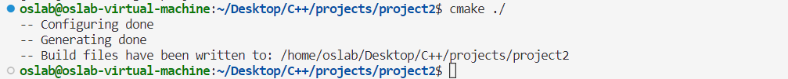

make

```
make
```

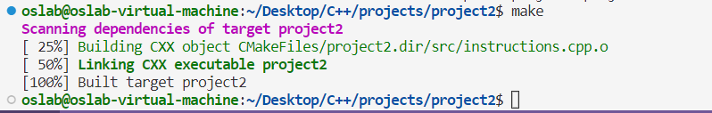

start program

```
./project2
```

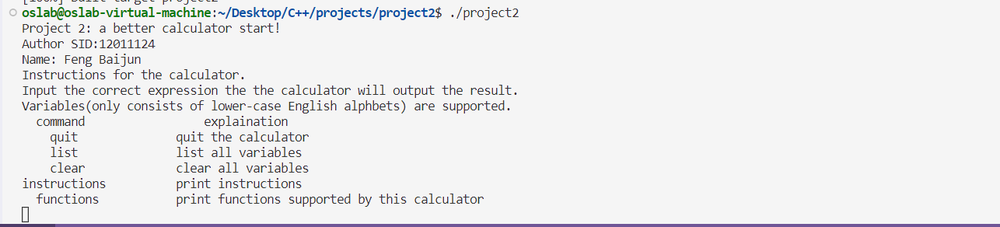


print functions

```
functions
```

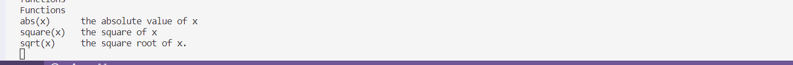


print instructions

```
instructions
```

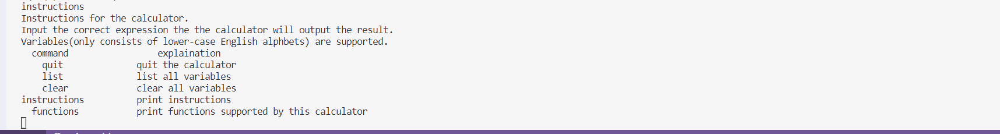


Test case #1

```
Input: 2+3
Output: 5
```


Test case #2

```
Input: 5+2*3
Output: 11
```


Test case #3

```
Input: 5+2*3
Output: 21
```


Test case #4

```
Input: 
x=3
y=6
x+2*y
Output: 15
```

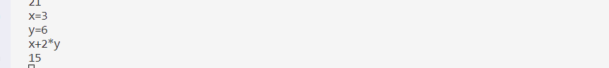


list variables

```
list
```

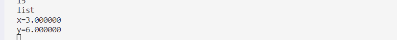


Test case #5

```
Input: sqrt(3)
Output: 1.73205
```

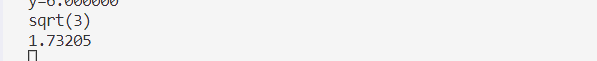


Test case #6

```
Input: sqrt(-1)
Output: The base of square root should be non-negtive!
```

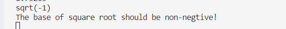


Test case #7

```
Input: sqrt(-1+2)
Output: 1
```

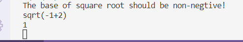


Test case #8

```
Input: abs(-12)
Output: 12
```

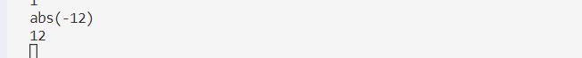


Test case #9

```
Input: -5*(-12)
Output: 60
```

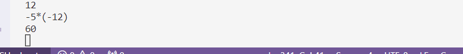


Test case #10

```
Input: square(-5)
Output: 25
```

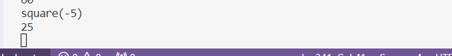


quit

```
quit
```

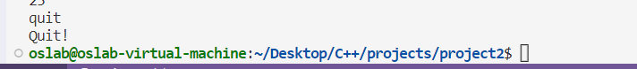

## Part 4 - Difficulties & Solutions

##### Difficulty 1

Use `int` for integer multiplication would cause overflow when large integers involved like `123456789*123456789`

###### My solution

Choose `long double`, which performs accurately for integer multiplications within the range of `long long`, and can deal with larger integers. 

As shown in the below figure, `long double` takes up 16 bytes(128 bits), while `long long` takes up only 8 bytes(64 bits).  Moreover,  `long double` performs accurately for integer arithmetics within the range of `long long`, since it is accurate to change its value with 1 unit of integer (which is 1) at the limit of the range of `long long`. Furthermore, `long double` can handle larger integer multiplication than `long long`. For example, to handle `123456789012*123456789012`, `long long` will cause overflow while `long double` will not.

##### Difficulty 2

Hard to handle the priority of expressions with parenthesis.

###### My solution

Use postfix expressions and stack for help.

Convert the normal expression into a postfix one.

Push numbers of a postfic expression into the stack for left to right . If handles an operator, pop corresponding numbers out fo the stack, compute the result and push the result into teh stack.

The result would be the only number left in the stack if nothing wrong.

##### Difficulty 3

Hard to handle validity of an expression.

###### My solution

Use `regex` for help.

GitLink

`https://github.com/whalefffall/C-Project2.git`